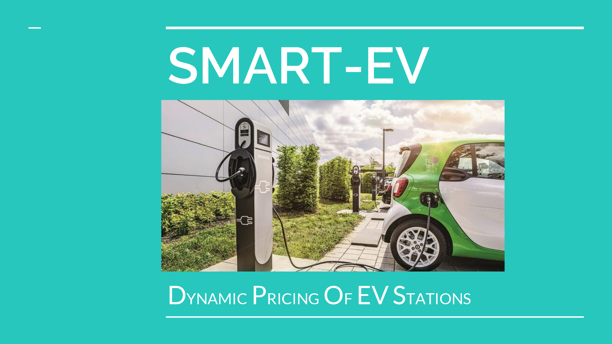
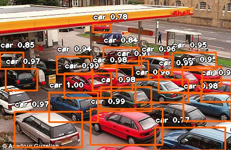
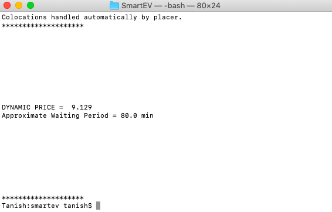

# SmartEV



This project basically aims to predict a dynamic price of EV charging station and the Waiting period which persists at that station. So one can look for the nearby EV station based on DYNAMIC PRICE & WAITING PERIOD<br>
I have taken into account 3 parameters which according to me should be able to predict Dynamic price of EV charging station:<br>
* **Number of Cars**

So it all starts with a Object detection model YOLO(You Look Only Once) which is used to detect all the cars from which we can get a count of total cars. For the testing purpose I'm using an image of station with queue of cars.

 

* **Time**

Time is nothing but what hour of the day it is, like 3 or 7 or 5  . . . So I have just taken my system's time for testing purpose.

* **Day/Night Time**

It just denotes am OR pm which can also be found by system's current time.

So pass these 3 inputs to my trained Model and you'll get Dynamic Price & waiting period as **Output!**



## Getting Started
These instructions will get you a copy of the project up and running on your local machine for development and testing purposes.

### Prerequisites
First, download the [YOLO Model File](https://drive.google.com/open?id=1GLBMg82uxev5UOlDE4GmLP18yUMAMCKx)<br>
I'm assuming you have Python & basic libraries like Numpy, Pandas etc. already installed.<br>

* PyTorch
```
pip3 install torch torchvision
```
Visit [PyTorch](https://pytorch.org/) to install torch according to your system requirements

* TensorFlow
```
pip3 install --upgrade tensorflow
```

* OpenCV
```
pip3 install opencv-python
```

* Keras
```
pip3 install keras
```
* ImageAI
```
pip3 install https://github.com/OlafenwaMoses/ImageAI/releases/download/2.0.3/imageai-2.0.3-py3-none-any.whl
```

### Have a Look
* 01 [Data Generation]() In this notebook you can have an insight of data generation.<br>

* 02 [Car Detection]() In this notebook you can see the object detection code with the help of ImageAI library.<br>

* 03 [Model Training]() This notebook is focused on Model training. I've used Regression model for the prediction which is trained with the help of PyTorch Library using our own Dataset that we created in first step.<br>

* 04 [Securing Model]() This notebook helps you secure the model with the help of Encrypted Deep learning. So you'll passing encrypted data to encrypted model and finally produce encrypted results.<br>

* 05 [Date & Time]() It's a small and simple notebook that will guide you how we can access system's Date & Time.

### Run
The jupyter notebooks I mentioned above are for your understanding, so that you can actually see what's happening under the hood, how data has been generated & how model has been trained.

Finally to see everything running you can just execute [run.py]() file.

## Built With
* [PyTorch](https://pytorch.org) - For Model Training
* [ImageAI](http://imageai.org/) - For Object Detection part

## Authors
* [Priyanshi Bhola]()
